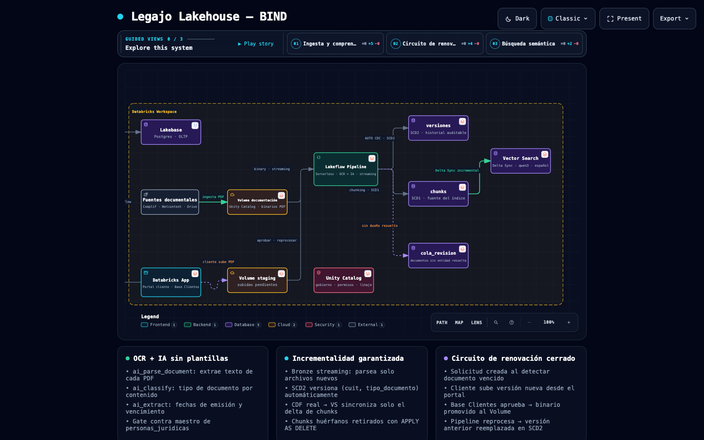
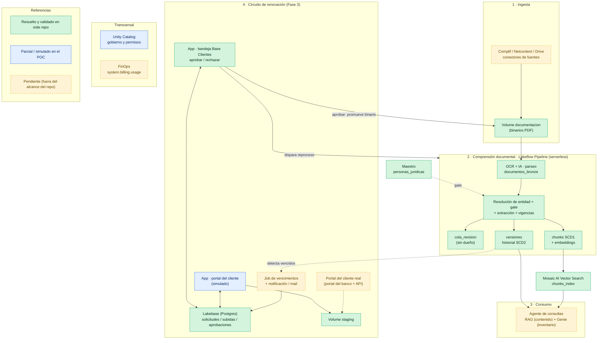

# Legajo Lakehouse — Gestión documental de personas jurídicas sobre Databricks

**Cliente:** BIND · **Tipo:** Prueba de Concepto (POC) · **Fecha:** 2026-09

Este documento explica **qué construimos, cómo funciona y cómo se ejecuta** la solución.

---

## Índice

1. [Resumen ejecutivo](#1-resumen-ejecutivo)
2. [Diagrama de arquitectura](#2-diagrama-de-arquitectura)
3. [Cómo funciona, de punta a punta](#3-cómo-funciona-de-punta-a-punta)
4. [Componentes de Databricks utilizados](#4-componentes-de-databricks-utilizados)
5. [El pipeline ETL (medallion)](#5-el-pipeline-etl-medallion)
6. [Función de cada tabla](#6-función-de-cada-tabla)
7. [La aplicación de aprobación (Databricks App)](#7-la-aplicación-de-aprobación-databricks-app)
8. [Estructura del proyecto y qué hace cada archivo](#8-estructura-del-proyecto-y-qué-hace-cada-archivo)
9. [Decisiones de diseño clave](#9-decisiones-de-diseño-clave)
10. [Cómo ejecutar / reproducir](#10-cómo-ejecutar--reproducir)
11. [Estado, pendientes y decisiones de negocio](#11-estado-pendientes-y-decisiones-de-negocio)

---

## 1. Resumen ejecutivo

**El problema.** BIND mantiene *legajos societarios* (KYC de personas jurídicas): estatutos,
poderes, actas, constancias de AFIP, estados contables, informes crediticios, etc. Esos
documentos llegan de varias fuentes, hay que saber **de qué entidad es cada uno**, **qué tipo
de documento es**, **si está vigente o vencido**, y hay que poder **consultarlos** y
**renovarlos** cuando caducan —con aprobación del área Base Clientes.

**La solución.** Un *lakehouse* de documentos sobre Databricks que:

- **Lee y entiende** cada documento con OCR + IA (sin plantillas rígidas).
- **Resuelve a qué entidad pertenece** (por nombre de archivo o por contenido) y **deja fuera
  lo que no puede resolver** en una cola de revisión (principio *"nada al limbo"*).
- **Extrae** tipo de documento y fechas, calcula **estado de vigencia** y mantiene un
  **historial versionado auditable**.
- **Indexa** el contenido para **búsqueda semántica** (preguntar en lenguaje natural), y lo
  hace **de forma incremental**: cuando cambia un documento, solo se reprocesa ese documento.
- **Cierra el círculo de renovación**: cuando un documento vence, el cliente sube la versión
  nueva, Base Clientes la **aprueba desde una app**, y automáticamente la versión anterior
  queda marcada como reemplazada y la nueva pasa a vigente en todo el sistema.

**Lo que aporta frente al notebook inicial del cliente:** procesamiento incremental (no
reprocesa todo cada vez), embeddings multilingües (español), chunking para RAG, control de
vigencias/versiones auditable, maestro de entidades (en vez de reglas fijas en el código) y un
circuito de aprobación operativo.

---

## 2. Diagrama de arquitectura

> Diagrama interactivo (dark/light, búsqueda semántica, vistas guiadas): **[ábrelo aquí](https://htmlpreview.github.io/?https://github.com/MiguelAngelJMZ/BIND_legajo_ocr/blob/main/legajo-lakehouse.html)** o descarga `legajo-lakehouse.html` y abrilo localmente.




Este diagrama pinta la **solución completa** y usa colores para indicar qué **resuelve este
repositorio** y qué **queda pendiente**:

- 🟢 **Verde** — construido y **validado end-to-end** en este repo.
- 🔵 **Azul** — **parcial o simulado** en el POC (funciona, pero en producción va distinto).
- 🟠 **Ámbar punteado** — **pendiente**, fuera del alcance actual del repo.



**Idea central:** el binario y todo el conocimiento derivado (texto, versiones, chunks, índice)
viven en **Unity Catalog / Delta**. El **estado operativo** del circuito de aprobación (quién
pidió qué, qué subió, quién aprobó) vive en **Lakebase (Postgres)**. La app orquesta ambos.

**Qué resuelve hoy este repo** (🟢): la **comprensión documental completa** (bloque 2), el
**índice de búsqueda** con sincronización incremental, y el **circuito de aprobación** de Base
Clientes con versionado auditable (bloque 4, salvo la subida real del cliente). **Qué falta**
(🟠): los **conectores de las fuentes** (bloque 1), el **agente de consultas** (bloque 3), el
**job de vencimientos + notificaciones** y el **portal externo real** del cliente, más FinOps.

---

## 3. Cómo funciona, de punta a punta

Recorrido en lenguaje de negocio (los nombres técnicos entre paréntesis):

1. **Llega un documento** al Volume (`documentacion`). En producción lo depositan las fuentes;
   en el POC lo simulamos subiendo PDFs.
2. **Se lee con OCR + IA** (`ai_parse_document`). Obtenemos el texto sin depender de plantillas.
3. **Se resuelve la entidad**: se busca el CUIT en el nombre del archivo y, si no está, en el
   contenido. Se valida contra el **maestro de entidades**. Si no hay match → **cola de
   revisión** (nunca se descarta silenciosamente).
4. **Se clasifica y se extraen fechas** (`ai_classify`, `ai_extract`): tipo de documento y
   fechas de emisión/vencimiento.
5. **Se normaliza y se calcula la vigencia**: fechas a formato fecha, regla de vencimiento por
   tipo, y estado `vigente` / `por_vencer` / `vencido`.
6. **Se versiona** (`versiones`, SCD2): cada `(entidad, tipo de documento)` tiene *una* versión
   vigente y un historial. Al llegar una versión nueva, la anterior se cierra automáticamente.
7. **Se trocea e indexa** (`chunks` → `chunks_index`): el texto se parte en fragmentos, se
   generan *embeddings* multilingües y se sincronizan al índice de **Vector Search** —solo el
   delta que cambió.
8. **Renovación (Fase 3):** cuando un documento vence, se crea una **solicitud**. El cliente
   sube la versión nueva desde el **portal** (app). Base Clientes la ve en su **bandeja**, la
   revisa (validaciones automáticas) y **aprueba**. Al aprobar, el binario se promueve al Volume
   y se dispara el pipeline → la versión vieja pasa a *reemplazada*, la nueva a *vigente*, y el
   índice se actualiza. **Circuito cerrado.**

---

## 4. Componentes de Databricks utilizados

| Necesidad | Componente Databricks | Por qué |
|---|---|---|
| Almacenar binarios y gobernar accesos | **Unity Catalog + Volumes** | Gobierno único (permisos, linaje, auditoría) sobre archivos y tablas. |
| Leer/entender documentos | **AI Functions** (`ai_parse_document`, `ai_classify`, `ai_extract`) | OCR + comprensión sin entrenar modelos ni mantener plantillas. |
| Orquestar el ETL incremental | **Lakeflow Declarative Pipeline** (serverless) | Declarativo, con checkpoints e incrementalidad automática. |
| Versionado auditable e incremental | **Streaming Tables + AUTO CDC (`APPLY CHANGES`)** | Historial SCD2 y upsert por chunk con *Change Data Feed* real. |
| Búsqueda semántica | **Mosaic AI Vector Search** (Delta Sync) | Índice gestionado que se sincroniza desde Delta solo con el delta. |
| Embeddings en español | Endpoint **`databricks-qwen3-embedding-0-6b`** | Multilingüe; el notebook original usaba uno solo en inglés. |
| Estado transaccional del workflow | **Lakebase** (Postgres gestionado) | OLTP para solicitudes/aprobaciones: escrituras rápidas, transaccional. |
| Interfaz de aprobación | **Databricks Apps** (Streamlit) | App gobernada por UC, corre como *service principal*, sin infra extra. |

---

## 5. El pipeline ETL (medallion)

El pipeline sigue la arquitectura **medallion** (bronze → silver → gold) y está definido como
un **Lakeflow Declarative Pipeline**. Todo el camino que alimenta el índice usa **streaming
tables** (no *materialized views*) — ver [§9](#9-decisiones-de-diseño-clave) por qué.

```
Volume ─► documentos_bronze ─► documentos_texto ─► documentos_resueltos ─┬─► documentos_con_dueno ─► documentos_extraidos ─► documentos_norm ─┬─► versiones   (SCD2 · historial → inventario/Genie)
 (PDFs)     (ai_parse)          (texto plano)       (CUIT + método)       └─► cola_revision (sin dueño)                                        └─► chunks_stream ─► chunks (SCD1) ─► [Vector Search]
```

- **BRONZE** (`01_bronze_parseo.sql`): parsea cada binario con OCR/IA. Streaming ⇒ solo procesa
  archivos nuevos (checkpoint) → no re-paga el parseo del stock ya visto.
- **SILVER** (`02_silver_resolucion.sql`, `03_silver_extraccion.sql`): texto plano → resolución
  de entidad → **gate** contra el maestro → clasificación/extracción → normalización de fechas
  y vigencia → versionado SCD2.
- **GOLD / chunks** (`04_gold_chunks.py`, `05_gold_chunks_cdc.sql`): trocea el texto e indexa la
  versión vigente; retira los chunks huérfanos de versiones que encogen.

**¿Corre todo el tiempo?** No. Está en modo **disparado (triggered)**: se ejecuta bajo demanda
(hoy manualmente o al aprobar en la app). En producción se agenda con un *Job* (por horario o
por *file-arrival trigger*). Como es serverless, entre corridas no consume cómputo.

---

## 6. Función de cada tabla

| # | Tabla | Tipo | Objetivo |
|---|-------|------|----------|
| — | `personas_juridicas` | tabla (setup) | **Maestro de entidades**. CUIT → razón social, oficial de cuenta, contacto. La *lee* el pipeline (reemplaza el `CASE WHEN` hardcodeado del notebook original). |
| 1 | `documentos_bronze` | streaming | **Parseo crudo**. Un registro por archivo del Volume con el resultado de `ai_parse_document` + metadata + hash. Incremental. |
| 2 | `documentos_texto` | streaming | **Texto plano**. Concatena los elementos parseados y expone `error_status` para separar parseos fallidos. |
| 3 | `documentos_resueltos` | streaming | **Resolución de entidad**. Deriva el CUIT (filename / contenido) y registra el `metodo_resolucion`. |
| 4 | `documentos_con_dueno` | streaming | **Gate — con dueño**. Los que validaron CUIT contra el maestro (*stream-static join*), enriquecidos. Solo estos avanzan. |
| 5 | `cola_revision` | streaming | **Gate — sin dueño**. Los que no resolvieron CUIT o cuyo CUIT no está en el maestro. Bandeja de revisión manual. |
| 6 | `documentos_extraidos` | streaming | **Extracción IA**. Agrega `tipo_documento` (`ai_classify`) y las fechas crudas (`ai_extract`). |
| 7 | `documentos_norm` | streaming | **Normalización**. Fechas → `DATE`, regla de vencimiento por tipo, `estado` y `id_version`. Fuente del AUTO CDC. |
| 8 | `versiones` | streaming · AUTO CDC **SCD2** | **Versionado auditable**. Una fila por versión de `(cuit, tipo_documento)` con historial (`__START_AT`/`__END_AT`). Fuente para inventario/Genie y Fase 3. |
| 9 | `chunks_stream` | streaming | **Chunking**. Explota el texto en fragmentos (~900 chars, con overlap) + eventos de retiro de huérfanos. |
| 10 | `chunks` | streaming · AUTO CDC **SCD1** | **Fuente del índice**. Upsert por `chunk_key` (`cuit\|tipo\|idx`). CDF real → Vector Search sincroniza solo el delta. |
| — | `chunks_index` | índice VS | **Retrieval**. Índice Delta Sync (embeddings `qwen3` multilingües); se consulta filtrando por `estado='vigente'`. |

**Tablas de estado del workflow (Lakebase / Postgres):**

| Tabla | Objetivo |
|-------|----------|
| `legajos.solicitudes` | Una fila por pedido de renovación (entidad + tipo). Máquina de estados: `notificado` → `pendiente_aprobacion` → `aprobado`/`rechazado`. |
| `legajos.subidas` | Una fila por archivo que el cliente sube contra una solicitud (ruta en staging + validaciones preliminares). |
| `legajos.aprobaciones` | Log auditable de decisiones de Base Clientes (quién, cuándo, qué, por qué). |

---

## 7. La aplicación de aprobación (Databricks App)

Una **Databricks App** en Streamlit con **dos vistas** (selector en la barra lateral):

**🏢 Portal del cliente** *(simulación del portal de autogestión)*
- Muestra los documentos que le fueron **notificados** por vencer.
- El cliente sube el PDF nuevo → se guarda en el **Volume de staging** → se corren
  **validaciones automáticas** (el CUIT coincide, el tipo coincide, la fecha es posterior) →
  la solicitud pasa a `pendiente_aprobacion`.
- *En producción esta subida entra por el portal del banco vía API; el circuito posterior es
  idéntico* (ver riesgo #1 en [§11](#11-estado-pendientes-y-decisiones-de-negocio)).

**✅ Base Clientes (aprobación)**
- Bandeja con las solicitudes `pendiente_aprobacion`: versión anterior vs. versión nueva, con
  los semáforos de validación.
- **Aprobar** → promueve el binario de *staging* al Volume `documentacion` + dispara el
  pipeline. El AUTO CDC marca la versión anterior como *reemplazada* y la nueva como *vigente*;
  el índice se actualiza solo con el delta.
- **Rechazar** → registra el motivo; el documento sigue en el ciclo de alertas.

**Cómo está montada:**
- Corre como *service principal*, gobernada por Unity Catalog.
- Lee/escribe el **estado** en Lakebase (Postgres); los **documentos** en UC.
- La contraseña de Postgres es un **token OAuth** (no hay credenciales fijas).
- Enruta al puerto `$DATABRICKS_APP_PORT` (gotcha resuelto — ver el `app.yaml`).

---

## 8. Estructura del proyecto y qué hace cada archivo

```
solucion/
├── README.md                          # este documento
├── databricks.yml                     # Asset Bundle: pipeline serverless + targets por entorno
├── deploy.sh                          # orquestador completo: setup → docs → pipeline → VS → Fase 3
├── subir_documentos.sh                # sube los PDFs simulados al Volume  Uso: ./subir_documentos.sh <perfil> <catalogo> <schema>
├── run_sql.py                         # helper: ejecuta .sql contra warehouse  --profile --warehouse --catalog --schema
├── vs_deploy.py                       # helper: crea/actualiza endpoint + índice VS  --profile --catalog --schema
├── vs_query.py                        # helper: prueba consultas semánticas  --profile --catalog --schema
│
├── docs_simulados/
│   ├── generar_documentos.py          # genera 12 PDFs societarios simulados (reportlab)
│   └── out/*.pdf                      # documentos generados (incluye v2 del test de incrementalidad)
│
├── src/
│   ├── setup/
│   │   ├── 01_setup_catalogo.sql      # crea catálogo, schema, volume y maestro (usa {catalog}/{schema})
│   │   └── 02_vector_search_index.py  # notebook de referencia del índice (en la práctica usamos vs_deploy.py)
│   └── pipeline/                      # Lakeflow Declarative Pipeline (todo streaming)
│       ├── 01_bronze_parseo.sql       # OCR/IA (ai_parse_document) → documentos_bronze
│       ├── 02_silver_resolucion.sql   # texto plano + resolución de entidad + gate + cola de revisión
│       ├── 03_silver_extraccion.sql   # ai_classify/ai_extract + normalización + versiones (AUTO CDC SCD2)
│       ├── 04_gold_chunks.py          # chunking + eventos de retiro de huérfanos → chunks_stream
│       └── 05_gold_chunks_cdc.sql     # AUTO CDC (SCD1) → chunks (fuente del índice)
│
└── fase3/                             # circuito de renovación + aprobación
    ├── 01_schema_lakebase.sql         # tablas solicitudes / subidas / aprobaciones (Postgres)
    ├── 02_setup_staging.sql           # Volume de staging (usa {catalog}/{schema})
    ├── run_pg.py                      # helper: ejecuta SQL contra Lakebase  --profile --host --user
    ├── seed_solicitudes.py            # siembra solicitudes desde documentos vencidos  --profile --warehouse --catalog --schema --pghost --pguser
    └── app/
        ├── app.py                     # Streamlit: portal del cliente + bandeja de aprobación
        ├── app.yaml                   # comando de arranque + variables de entorno (completar antes de deploy)
        └── requirements.txt           # dependencias de la app
```

---

## 9. Decisiones de diseño clave

**¿Por qué streaming tables y no Materialized Views?**
Las MV de Lakeflow **no exponen Change Data Feed** (`table_changes` falla con
`MATERIALIZED_VIEW_UNSUPPORTED_OPERATION`) y **se sobrescriben enteras** en cada refresh. Eso
rompe el sync incremental de Vector Search (re-embeberían todo el corpus cada vez). Por eso todo
el camino de retrieval son **streaming tables + AUTO CDC**: `versiones` en **SCD2** (historial
auditable) y `chunks` en **SCD1** (upsert por chunk → CDF real → VS sincroniza solo el delta).
*Comprobado empíricamente durante el POC.*

**Definición de "documento único".** El documento lógico se define por `(cuit, tipo_documento)`:
una versión vigente por entidad y por tipo; una versión nueva reemplaza a la anterior.

| Identificador | Qué identifica | Granularidad |
|---|---|---|
| `cuit` + `tipo_documento` | el **documento lógico** | 1 por entidad+tipo |
| `file_hash` (`sha2(content,256)`) | el **binario** exacto (dedup entre fuentes) | 1 por archivo idéntico |
| `id_version` | una **versión física** | 1 por instancia que llega |
| `chunk_key` (`cuit\|tipo\|idx`) | un **fragmento** | N por documento |

⚠️ **Decisión a cerrar con negocio:** esta clave funciona para renovaciones (poder, estatuto,
constancia) pero **se rompe** para tipos con varios documentos distintos que NO son versiones
entre sí — caso claro: `estados_contables` (el balance 2024 y el 2025 son distintos, no
versiones). Para esos tipos hay que **enriquecer la clave** (agregar ejercicio/`fecha_emision`
o un id de documento). Es parte del catálogo de tipos de documento a definir con negocio.

**Retiro de chunks huérfanos.** Cuando una versión nueva produce **menos** chunks que la
anterior, los slots sobrantes quedaban colgados en el índice con el estado viejo. `chunks_stream`
emite, además de los chunks reales (`_op='upsert'`), eventos de retiro (`_op='delete'`) para los
slots `[N, MAX_SLOTS)`, y el AUTO CDC (`APPLY AS DELETE WHEN _op='delete'`) los borra.

**Otros gotchas resueltos:**
- **`MANAGED LOCATION`**: solo requerida en algunos sandboxes *clásicos*. Los workspaces serverless
  con metastore de cuenta usan la ubicación por defecto; `CREATE CATALOG` sin `MANAGED LOCATION`
  funciona. Si el workspace la requiere, descomentar la línea en `01_setup_catalogo.sql` y ajustar
  la ruta S3/ABFS.
- Cambiar el tipo de un dataset (MV→streaming) exige `DROP` previo + `--full-refresh-all`.
- `APPLY CHANGES` SCD2 no soporta columnas `VARIANT` (falla en `<=>`): no arrastrar
  `parsed_content` a la fuente del AUTO CDC.
- Databricks Apps enruta al puerto `$DATABRICKS_APP_PORT` (=8000), no 8501.
- **`databricks apps deploy --source-code-path`** requiere el prefijo `/Workspace/` completo
  (ej: `/Workspace/Users/tu@email.com/mi-app`). Sin el prefijo la CLI devuelve
  *"Source code path must be a valid workspace path"*.
- **Permisos UC del service principal de la app:** para acceder a los Volumes vía Files API el SP
  necesita `USE_CATALOG`, `USE_SCHEMA`, `READ_VOLUME` y `WRITE_VOLUME` en la jerarquía
  catálogo → schema → volume. El script `deploy.sh` los otorga automáticamente post-deploy.
- **`PGUSER` en la app:** cuando la app corre como service principal, el usuario Postgres es el
  `applicationId` del SP (UUID), no el email del desarrollador. `app.py` deriva el usuario con
  `w.current_user.me().user_name` para que funcione en ambos contextos (local y app).

---

## 10. Cómo ejecutar en tu entorno

La solución es **completamente portable**: ningún archivo del repositorio tiene valores
hardcodeados de entorno. Todo se pasa como argumento en el momento del despliegue.

### 10.1 Prerrequisitos del workspace

- **Unity Catalog** habilitado con permiso para crear catálogo/schema/volumen.
- **Serverless** habilitado: SQL warehouse serverless (helpers) + cómputo serverless para pipelines.
- **Mosaic AI Vector Search** habilitado con un endpoint de embeddings multilingüe
  (`databricks-qwen3-embedding-0-6b` o similar que soporte español).
- **(Fase 3)** una instancia de **Lakebase** y permiso para crear una **Databricks App**.
- **CLI de Databricks** instalado y Python 3 local (el script crea el venv automáticamente).

### 10.2 Parámetros

| Variable | Qué es | Ejemplo |
|---|---|---|
| `PROFILE` | Perfil CLI de Databricks | `fe-sandbox-serverless` |
| `TARGET` | Target del bundle | `fe-sandbox-serverless` |
| `CATALOG` | Catálogo Unity Catalog destino | `bind_ocr` |
| `SCHEMA` | Schema destino | `legajos` |
| `WAREHOUSE_ID` | ID del SQL warehouse serverless | `b59432616c8f8bd1` |
| `EMBEDDING` | Endpoint de embeddings (opcional) | `databricks-qwen3-embedding-0-6b` |
| `PGHOST` | Host de la instancia Lakebase (Fase 3) | `ep-xxx.database.us-east-2.cloud.databricks.com` |
| `PGUSER` | Email del propietario de Lakebase (Fase 3) | `tu@databricks.com` |
| `DB_INSTANCE` | Nombre de la instancia Lakebase (Fase 3) | `bind_ocr` |
| `APP_NAME` | Nombre de la Databricks App (Fase 3) | `legajo-lakehouse` |

### 10.3 No hay nada que editar en los archivos

Todos los scripts reciben catálogo, schema, perfil y warehouse como argumentos de CLI.
**El pipeline (`src/pipeline/`) no se toca nunca**: lee catálogo/schema de las variables del
bundle (`databricks.yml`). El setup SQL usa `{catalog}` / `{schema}` como placeholders que
`run_sql.py` sustituye al vuelo con `--catalog` y `--schema`.

Los únicos valores que hay que ajustar antes del deploy de la app son los del bloque `env` en
`fase3/app/app.yaml` (PIPELINE_ID, VOL_STAGING, VOL_DOCS, DATABRICKS_DATABASE_INSTANCE, PGHOST).
El script `deploy.sh` los rellena automáticamente.

Para agregar un nuevo entorno al bundle, basta con añadir un target en `databricks.yml`:

```yaml
targets:
  mi-entorno:
    workspace:
      host: https://mi-workspace.cloud.databricks.com
```

### 10.4 Despliegue

**Opción A — script orquestador (recomendado):**

```bash
cd <ruta>/solucion

# Auth (una vez)
databricks auth login --host <HOST> --profile <PERFIL>

# Despliegue completo (pregunta lo que falte)
PROFILE=<PERFIL> TARGET=<TARGET> CATALOG=<CATALOGO> SCHEMA=<SCHEMA> \
WAREHOUSE_ID=<WAREHOUSE_ID> bash deploy.sh
```

El script crea el venv, ejecuta los 5 pasos en orden, captura el PIPELINE_ID
automáticamente y, si elegís desplegar la Fase 3, también otorga todos los permisos
al service principal de la app (USE_CATALOG, USE_SCHEMA, READ/WRITE_VOLUME, CAN_RUN pipeline,
GRANT en Lakebase).

**Opción B — pasos manuales:**

```bash
# 0. Auth
databricks auth login --host <HOST> --profile <PERFIL>

# 1. Setup
python3 run_sql.py src/setup/01_setup_catalogo.sql \
  --profile <PERFIL> --warehouse <WAREHOUSE_ID> --catalog <CATALOGO> --schema <SCHEMA>

# 2. Documentos
python3 docs_simulados/generar_documentos.py
bash subir_documentos.sh <PERFIL> <CATALOGO> <SCHEMA>

# 3. Pipeline
databricks bundle validate -p <PERFIL> -t <TARGET> --var="catalog=<CATALOGO>" --var="schema=<SCHEMA>"
databricks bundle deploy   -p <PERFIL> -t <TARGET> --var="catalog=<CATALOGO>" --var="schema=<SCHEMA>"
databricks bundle run legajos_pipeline -p <PERFIL> -t <TARGET> --var="catalog=<CATALOGO>" --var="schema=<SCHEMA>"
# Si cambiaste tipos de tabla: añadir --full-refresh-all al run

# 4. Vector Search
python3 vs_deploy.py --profile <PERFIL> --catalog <CATALOGO> --schema <SCHEMA>
python3 vs_query.py  --profile <PERFIL> --catalog <CATALOGO> --schema <SCHEMA>

# 5. Fase 3 (Lakebase + app)
python3 fase3/run_pg.py fase3/01_schema_lakebase.sql \
  --profile <PERFIL> --host <PGHOST> --user <PGUSER>

python3 run_sql.py fase3/02_setup_staging.sql \
  --profile <PERFIL> --warehouse <WAREHOUSE_ID> --catalog <CATALOGO> --schema <SCHEMA>

python3 fase3/seed_solicitudes.py \
  --profile <PERFIL> --warehouse <WAREHOUSE_ID> \
  --catalog <CATALOGO> --schema <SCHEMA> \
  --pghost <PGHOST> --pguser <PGUSER> --estado notificado

# Actualizar fase3/app/app.yaml con PIPELINE_ID, VOL_STAGING, VOL_DOCS, PGHOST, DB_INSTANCE
# Luego:
databricks sync fase3/app "Users/<PGUSER>/<APP_NAME>-app" -p <PERFIL> --full
databricks apps deploy <APP_NAME> \
  --source-code-path "/Workspace/Users/<PGUSER>/<APP_NAME>-app" -p <PERFIL>

# Permisos del SP de la app (obtener SP_APPID del paso anterior):
SP_ID=$(databricks apps get <APP_NAME> -p <PERFIL> --output json | python3 -c \
  "import json,sys; print(json.load(sys.stdin)['service_principal_id'])")
SP_APPID=$(databricks service-principals get $SP_ID -p <PERFIL> --output json | python3 -c \
  "import json,sys; print(json.load(sys.stdin)['applicationId'])")

databricks grants update catalog <CATALOGO> -p <PERFIL> \
  --json "{\"changes\":[{\"principal\":\"$SP_APPID\",\"add\":[\"USE_CATALOG\"]}]}"
databricks grants update schema <CATALOGO>.<SCHEMA> -p <PERFIL> \
  --json "{\"changes\":[{\"principal\":\"$SP_APPID\",\"add\":[\"USE_SCHEMA\"]}]}"
for VOL in staging documentacion; do
  databricks grants update volume <CATALOGO>.<SCHEMA>.$VOL -p <PERFIL> \
    --json "{\"changes\":[{\"principal\":\"$SP_APPID\",\"add\":[\"READ_VOLUME\",\"WRITE_VOLUME\"]}]}"
done
databricks pipelines update-permissions <PIPELINE_ID> -p <PERFIL> \
  --json "{\"access_control_list\":[{\"service_principal_name\":\"$SP_APPID\",\"permission_level\":\"CAN_RUN\"}]}"

python3 fase3/run_pg.py --profile <PERFIL> --host <PGHOST> --user <PGUSER> \
  --sql "GRANT USAGE ON SCHEMA legajos TO \"$SP_APPID\"; \
         GRANT SELECT,INSERT,UPDATE ON ALL TABLES IN SCHEMA legajos TO \"$SP_APPID\";"
```

**Casos de prueba embebidos** (en los PDFs simulados):

| Documentos | Resolución esperada |
|------------|---------------------|
| 6 con CUIT en el nombre de archivo | determinístico (nivel 1) |
| 2 con CUIT solo en el contenido    | por contenido (nivel 3) |
| 2 sin CUIT (DNI, control interno)  | cola de revisión (nivel 4) |

**Test de incrementalidad:** `30712345678_poder_general_v2.pdf` es la v2 del poder. Al
ingerirla: `versiones` cierra la v1 (`__END_AT`) y abre v2 `vigente`; `chunks` hace upsert en el
lugar; el CDF muestra solo el delta del poder; el índice re-embebe solo eso.

**Test del circuito de renovación:** sembrá solicitudes con `seed_solicitudes.py --estado notificado`,
subí un PDF desde el portal del cliente en la app, y aprobalo desde Base Clientes. Verificar:
Lakebase → `aprobado`; Volume `documentacion` → binario promovido; `versiones` → v1 con `__END_AT`
y v2 con `__END_AT = NULL`; `chunks` → apuntando al nuevo `id_version`.

---

## 11. Estado, pendientes y decisiones de negocio

### ✅ Construido y validado end-to-end
- Pipeline completo bronze→silver→gold (parseo, resolución, gate, extracción, vigencias,
  versionado, chunking) sobre datos simulados.
- Índice de Vector Search con **incrementalidad probada** (solo re-embebe el delta).
- **Circuito de renovación cerrado**: subida del cliente → aprobación en la app → promoción →
  reproceso → versión anterior *reemplazada* / nueva *vigente* → índice actualizado.
- **Despliegue reproducible** validado: `deploy.sh` despliega de cero en cualquier workspace
  compatible sin editar ningún archivo del repositorio.

### ❌ Pendiente por desarrollar
- **Conectores reales** de las 3 fuentes (Complif, Netcontent, Drive) — hoy la ingesta se simula.
- **Agente de consultas**: RAG sobre `chunks_index` + Genie sobre `versiones` (contenido vs. inventario).
- **Job de vencimientos + notificaciones** que dispara automáticamente las solicitudes.
- **Portal de subida real** del cliente (hoy simulado dentro de la app).
- **FinOps** con `system.billing.usage` + *usage policies*.
- **Orquestación**: Job con *file-arrival trigger* o schedule (hoy se dispara manual / al aprobar).

### 🔴 Decisiones a cerrar con negocio / seguridad
1. **Identidad del cliente externo (riesgo #1):** Databricks Apps no admite usuarios externos
   anónimos → el frontend de subida debe vivir en el **portal del banco + API**.
2. **Catálogo de tipos de documento + reglas de vencimiento + granularidad del "documento
   único"** (ver el caso de los estados contables en [§9](#9-decisiones-de-diseño-clave)).
3. Cierre de fuentes, política de avisos/mail, retención y confidencialidad.
